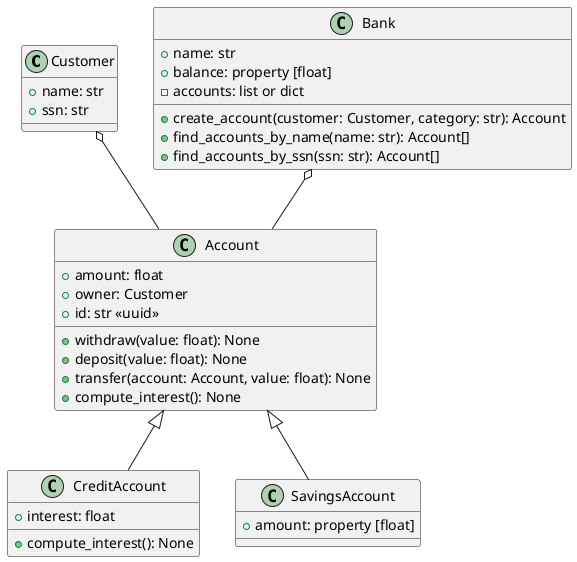

# ACIT2515 Banking Lab

## Class diagram



## Project Description

You will be writing a project to implement the above classes. The `Customer`
class is provided for you in `customer.py`

You will need to create the remaining classes and files. A full suite of tests
has been provided you are finished when all of the tests pass.

## 0. Project Setup

1. Get scaffold code form the course notes repostiory.
1. Directory Structure
   1. Open the root lab directory: `banking` in VSCode
   1. The following is the desired directory structure for this :
   ```
   banking
   ├───.venv
   ├───.vscode
   ├───tests
   │   ├───test_account.py
   │   ├───test_bank.py
   │   ├───test_credit_savings.py
   │   └───test_customer.py
   │
   ├───.gitignore
   ├───.python-version
   ├───account.py
   ├───bank.py
   ├───customer.py
   ├───lab-bank.md
   ├───pyproject.toml
   └───uv.lock
   ```
1. UV setup

   1. Initialize current project root directory `uv init`
   1. Add pytest and pytest coverage: `uv add --dev pytest pytest-cov`

1. VSCode Setup
1. Set the interpreter for the VSCode to use the one in the `.venv`
   1. [VSCode setting the Python environment / interpreter](https://code.visualstudio.com/docs/python/environments#_working-with-python-interpreters)
1. Configure VSCode to use `pytest`
   1. [Python testing in Visual Studio Code](https://code.visualstudio.com/docs/python/testing)
1. Configure VSCode Python Debugging and creating `.vscode/launch.json`
   1. [Python debugging in VS Code](https://code.visualstudio.com/docs/python/debugging)

## 1. Use the `Customer` class

A customer has:

- a name
- a SSN (Social Security Number)

The code for this class is already provided.

## 2. Build the `Account` class in `account.py`

A bank account has:

- "owner": a `Customer` instance
- an amount (float, default value: 0)
- an id: (str, Universally Unique ID)
- a method `deposit`
  - it receives an `int` or `float` argument: the amount to be deposited. If the
    argument is negative, raise a `AttributeError` exception.
  - it adds the deposited amount to the account amount
- a method `withdraw`
  - it receives an `int` or `float` argument: the amount to be withdrawn. If the
    argument is negative, raise a `AttributeError` exception.
  - it removes the amount provided from the account
- a method `transfer`, to make transfers between accounts
  - it has two arguments: `account` and `amount`
  - it must raise a `TypeError` exception if the account is not an instance of
    `Account`
  - the method withdraws `amount` from the current instance and deposits it into
    the `account`

## 3. Build child classes

### 3.1. `CreditAccount`

- The credit account inherits from `Account`. Its amount is typically negative.
- Its constructor receives an additional argument: the interest rate (a number
  between 0 and 100).
- This is the interest rate in %. Store it as an attribute of your class.
- The `compute_interest` method, **if the amount is negative**:
  - charges the interest to the account:
    `amount = amount * (100 + interest_rate) / 100`
  - then charges $10 to the account (administration fees)

### 3.3. `SavingsAccount`

- The savings account inherits from `Account`.
- A savings account cannot have an amount less than 0. Use a `@property`!

## 4. Build the `Bank` in `bank.py`

- A bank has a name (received by the constructor)

- `create_account`: creates an account in the bank. Receives two mandatory
  arguments
  - `category`: can be either "account", "credit", or "savings"
  - `owner`: a `Customer` instance
  - and an optional argument: `interest_rate` (default value = 0)
    - credit accounts must use this value for the interest rate
  - this method creates an account of the specified type, associates it with the
    provided owner
  - the method **returns** the account created, but you need to make sure your
    bank keeps track of the accounts (you could use a dictionary, or a list)
- `find_accounts_by_ssn()`: receives one argument
  - first argument is a string: the social security number of a customer
  - the method returns the list of account(s) associated with the given customer
- `find_accounts_by_name()`: receives one argument
  - first argument is a string: (part of) the name of the customer
  - the method returns the list of account(s) belonging to customers whose name
    matches the string provided
- `balance`: a **property**
  - its value is the sum of all amounts of all bank accounts managed by the bank

# References

The following a are a series of just in time references that you may want to
check

## Inheritence

1. [How to call a super class init](https://realpython.com/python-super/)

## Type Checking

1. [Verify Types using `isinstance()`](https://docs.python.org/3/library/functions.html#isinstance)
1. [What does `isinstance()` do?](https://realpython.com/what-does-isinstance-do-in-python/)

## Python Exception and Error Types.

1. https://docs.python.org/3/tutorial/errors.html
1. https://docs.python.org/3/library/exceptions.html#bltin-exceptions

## Universally Unique IDs

1. [`uuid` - Create UUIDs](https://docs.python.org/3/library/uuid.html) use `uuid.uuid4()`
