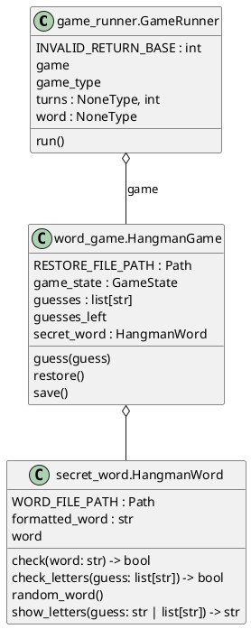

```plantuml
@startuml classes
set namespaceSeparator none

class "game_runner.GameRunner" as game_runner.GameRunner {
  INVALID_RETURN_BASE : int
  game
  game_type
  turns : NoneType, int
  word : NoneType
  run()
}

class "secret_word.HangmanWord" as secret_word.HangmanWord {
  WORD_FILE_PATH : Path
  formatted_word : str
  word
  check(word: str) -> bool
  check_letters(guess: list[str]) -> bool
  random_word()
  show_letters(guess: str | list[str]) -> str
}

class "word_game.HangmanGame" as word_game.HangmanGame {
  RESTORE_FILE_PATH : Path
  game_state : GameState
  guesses : list[str]
  guesses_left
  secret_word : HangmanWord
  guess(guess)
  restore()
  save()
}

word_game.HangmanGame o-down- secret_word.HangmanWord
word_game.HangmanGame -up-o game_runner.GameRunner : game
@enduml
```