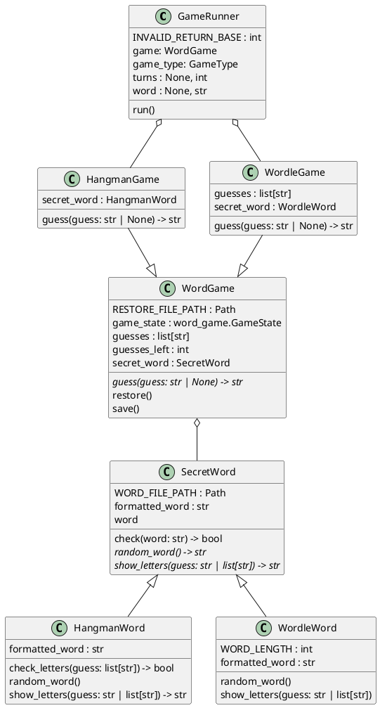

```plantuml
@startuml classes
set namespaceSeparator none

class "GameRunner" as game_runner.GameRunner {
  INVALID_RETURN_BASE : int
  game: WordGame
  game_type: GameType
  turns : None, int
  word : None, str
  run()
}

class "SecretWord" as secret_word.SecretWord {
  WORD_FILE_PATH : Path
  formatted_word : str
  word
  check(word: str) -> bool
  {abstract}random_word() -> str
  {abstract}show_letters(guess: str | list[str]) -> str
}

class "HangmanWord" as secret_word.HangmanWord {
  formatted_word : str
  check_letters(guess: list[str]) -> bool
  random_word()
  show_letters(guess: str | list[str]) -> str
}
class "WordleWord" as secret_word.WordleWord {
  WORD_LENGTH : int
  formatted_word : str
  random_word()
  show_letters(guess: str | list[str])
}

class "WordGame" as word_game.WordGame {
  RESTORE_FILE_PATH : Path
  game_state : word_game.GameState
  guesses : list[str]
  guesses_left : int
  secret_word : SecretWord
  {abstract}guess(guess: str | None) -> str
  restore()
  save()
}

class "HangmanGame" as word_game.HangmanGame {
  secret_word : HangmanWord
  guess(guess: str | None) -> str
}

class "WordleGame" as word_game.WordleGame {
  guesses : list[str]
  secret_word : WordleWord
  guess(guess: str | None) -> str
}

secret_word.HangmanWord -up-|> secret_word.SecretWord
secret_word.WordleWord -up-|> secret_word.SecretWord
word_game.HangmanGame -down-|> word_game.WordGame
word_game.WordleGame -down-|> word_game.WordGame
word_game.HangmanGame -up-o game_runner.GameRunner
word_game.WordleGame -up-o game_runner.GameRunner
word_game.WordGame o-down- secret_word.SecretWord
@enduml
```